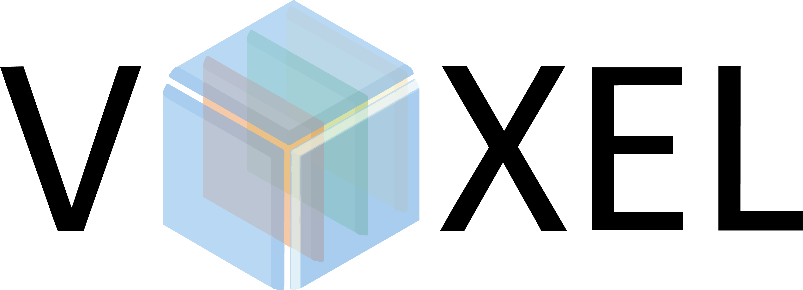

# AI for Laser Aberration Correction

  

## Tech Stack

  
  
  
  
  
  
  
  

**Environment & Tools:**

* Google Colab: Primary development and execution environment.
* Jupyter Notebook: For interactive coding and data analysis.

**Core Libraries:**

* Python: Base programming language.
* TensorFlow & Keras: For building and training the LSTM neural network.
* Pandas: For data manipulation and CSV file operations.
* NumPy: For numerical operations and array handling.
* Matplotlib: For data visualization.

**Hardware Specific (Conceptual/Control):**

* Libraries for Spatial Light Modulator (SLM) control (specifics depend on the hardware).
* Libraries for Deformable Mirror (DM) control (specifics depend on the hardware).

Artificial Intelligence and Bayesian Optimization Research for High Frequency Laser Aberration Correction.

## Overview

This project focuses on correcting optical aberrations in a laser system. The core idea is to:

1. Characterize the aberrations introduced by the optical system by studying its Zernike coefficients.
2. Train an Artificial Neural Network (ANN), specifically an LSTM, to predict these Zernike coefficients based on input data (likely images of the laser beam profile).
3. Calculate the symmetric (opposite) Zernike coefficients required for correction.
4. Apply these corrective coefficients using a Spatial Light Modulator (SLM) or a Deformable Mirror (DM) to counteract the system's aberrations and achieve a corrected laser beam.

## Methodology

* **Prediction Model:** An LSTM (Long Short-Term Memory) neural network (`Neural Network Final.ipynb`) is used to predict the Zernike coefficients of the optical system.
* **Correction Hardware Control:**
  * A Spatial Light Modulator (SLM) is the primary intended device for applying the corrections.
  * Alternatively, the `Deformable Mirror.py` script provides control for a Deformable Mirror (DM) if an SLM is unavailable.
* **Legacy Approach:** Bayesian Optimization was previously explored but is now considered legacy; the focus is on the LSTM approach.

## Data

* **Datasets:** Several directories (`Actual Data Set/`, `Alex__dataset/`, `data set - mini/`, `data_set/`) contain datasets used for training and evaluation.
* **Format:** The primary dataset format involves CSV files containing Zernike coefficients and corresponding images (likely beam profiles).
* **Collection:** The `Final Recolha do Data Set.ipynb` notebook contains the algorithm and process used to collect the training/testing data.

## Setup

* **Environment:** The project is developed and run primarily on Google Colab.
* **Python Version:** Uses the standard Python version available in Google Colab.
* **Dependencies:** Required libraries are imported within the individual `.ipynb` notebooks and `.py` scripts. Key libraries likely include TensorFlow/Keras (for the LSTM), Pandas, NumPy, Matplotlib, and potentially hardware-specific libraries for the DM/SLM.
* **Hardware:** No specific local hardware is strictly required if running on Google Colab, but access to the optical setup (laser, SLM/DM, camera) is necessary for data collection and real-time correction.

## Usage Workflow

The recommended order for running the scripts/notebooks is:

1. **Data Collection:**
   * Run `Final Recolha do Data Set.ipynb` to collect the necessary image and Zernike coefficient data from the optical setup.
2. **Data/Image Management:**
   * Run `Guilherme.ipynb` (presumably for processing or organizing the collected images/data).
3. **Further Processing/Analysis:**
   * Run `Alex.ipynb` (likely performs additional data analysis or preparation steps).
4. **Neural Network Training/Prediction:**
   * Run `Neural Network Final.ipynb` to train the LSTM model on the prepared dataset or use a pre-trained model to predict Zernike coefficients.
5. **Correction (Conceptual):**
   * Use the predicted coefficients (negated) to control the SLM or DM (`Deformable Mirror.py`) to correct the laser aberrations. *(Note: The direct integration/script for this final step might be separate or within one of the notebooks).*

## Key Files & Directories

* `Neural Network Final.ipynb`: Main notebook for the LSTM model.
* `Final Recolha do Data Set.ipynb`: Notebook for data acquisition.
* `Guilherme.ipynb`, `Alex.ipynb`: Notebooks for data processing/analysis.
* `Deformable Mirror.py`: Script for controlling the Deformable Mirror.
* `Actual Data Set/`, `Alex__dataset/`, `data set - mini/`, `data_set/`: Directories containing datasets.
* `LSTM/`: Directory potentially containing LSTM model specifics or related files.
* `LICENSE`: Project license file.
* `README.md`: This file.

## Results

The primary achievement highlighted is the successful development and training of the ANN (LSTM) capable of predicting the Zernike coefficients associated with the optical system's aberrations.

## License

This project is licensed under the terms specified in the [LICENSE](LICENSE) file.
